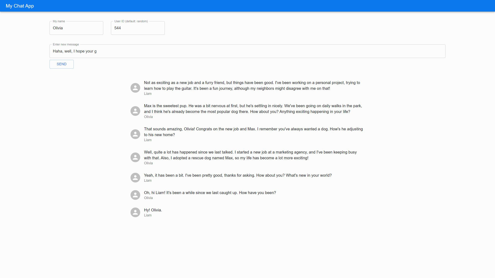

# My Chat App
A sample chat app using React and Express.

# Installation
## client
```
cd client
npm i
```
## server
```
cd server
npm i
```

# Usage
## client
```
cd client
npm start
```
## server
```
cd client
npm start
```
Then open multiple localhost:3000 in your browser. And you can use my-chat-app.
- localhost:3000 -client
- localhost:5000 -server

# Demo


# Author
https://github.com/iizuka-0000

# License
See LICENSE.
